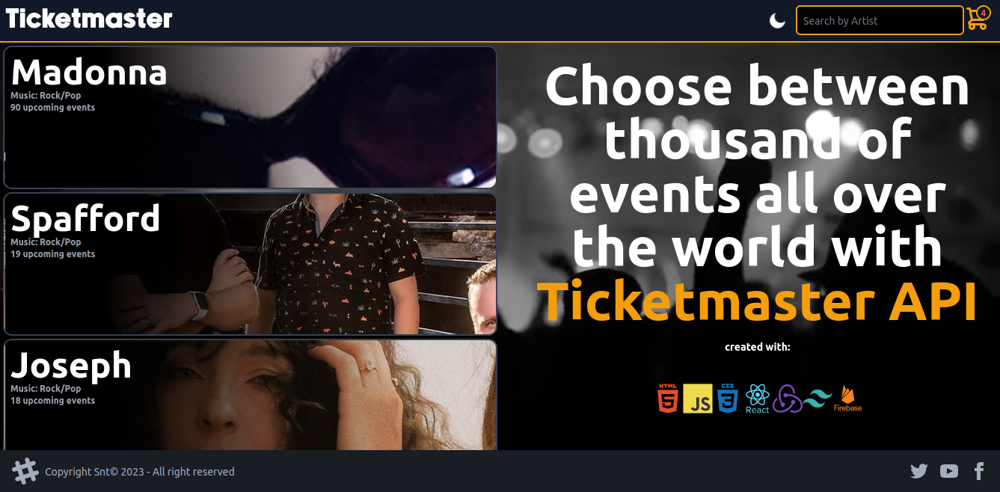
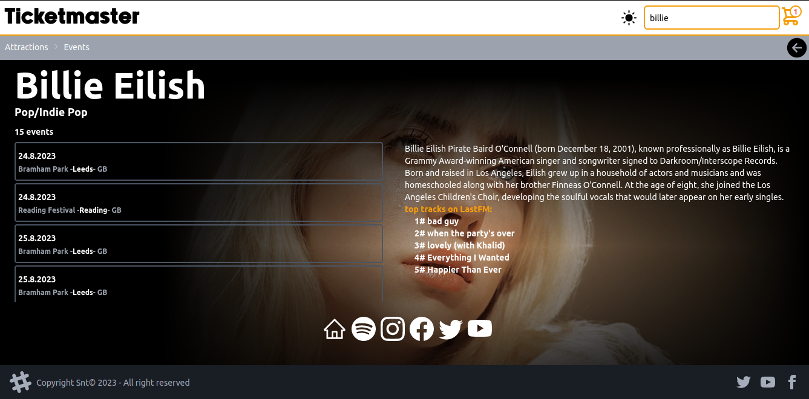
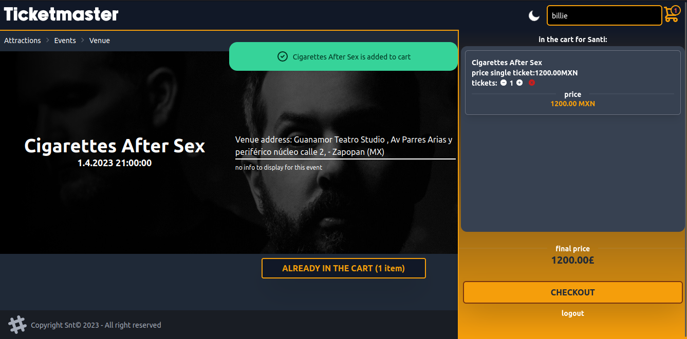

# v2 Ticketmaster Web App

This project was bootstrapped with [Create React App](https://github.com/facebook/create-react-app).

## Description
 This project uses the Ticketmaster API to display event information and allows users to add events to their cart. Built with React, Redux, TailwindCSS, DaisyUI, and Firebase, this demo showcases a sleek and responsive design.

 The project is fully tested and includes continuous integration and deployment. 
 

 Try it out and experience the convenience of a seamless, fully responsive online shopping experience!

## Available Scripts

In the project directory, you can run:

### `npm start`

Runs the app in the development mode.\
Open [http://localhost:3000](http://localhost:3000) to view it in your browser.

The page will reload when you make changes.\
You may also see any lint errors in the console.

### `npm test`

Launches the test runner in the interactive watch mode.\
See the section about [running tests](https://facebook.github.io/create-react-app/docs/running-tests) for more information.

